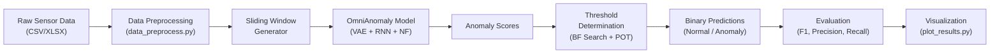
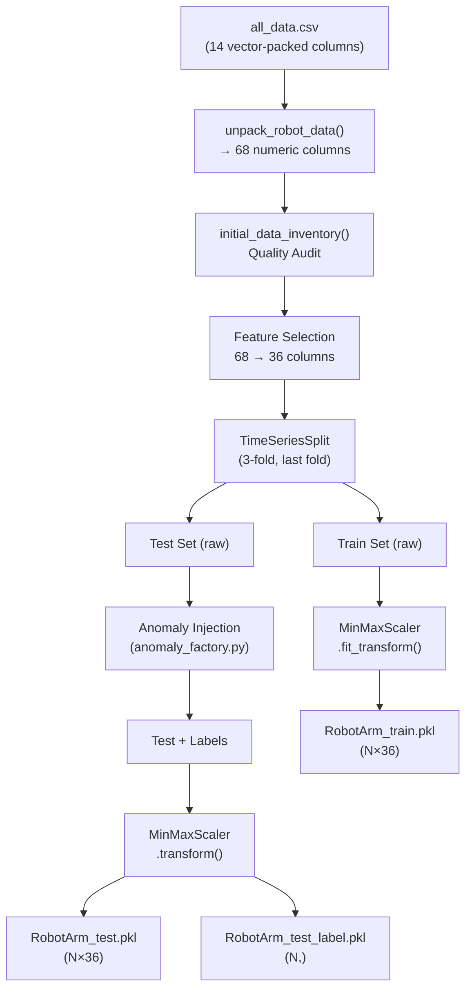
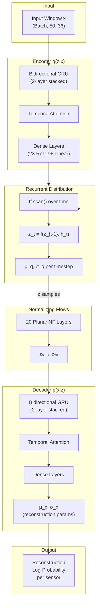
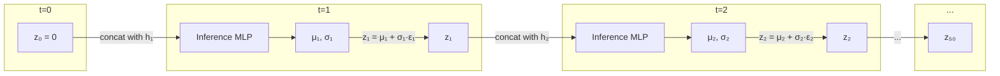
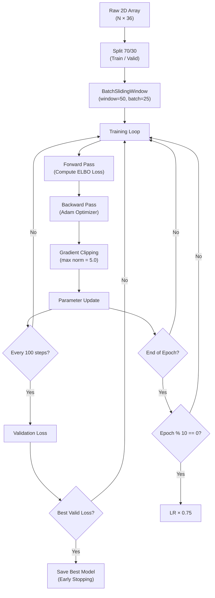
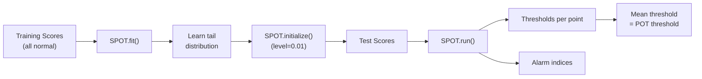

# CoreX Version 1 — Baseline OmniAnomaly: Complete Architecture Report

> **Purpose**: This document provides a complete, book-quality breakdown of every component in the CoreX Version 1 Baseline system — a multivariate time-series anomaly detection model based on OmniAnomaly, applied to industrial Robot Arm sensor data.

---

## Table of Contents

1. [System Overview](#1-system-overview)
2. [Data Ingestion & Preprocessing Pipeline](#2-data-ingestion--preprocessing-pipeline)
3. [Model Architecture — The OmniAnomaly Core](#3-model-architecture--the-omnianomaly-core)
   - 3.1 [High-Level Architecture Diagram](#31-high-level-architecture-diagram)
   - 3.2 [Component A: The Encoder — q(z|x)](#32-component-a-the-encoder--qzx)
   - 3.3 [Component B: Normalizing Flows](#33-component-b-normalizing-flows)
   - 3.4 [Component C: The Recurrent Distribution](#34-component-c-the-recurrent-distribution)
   - 3.5 [Component D: The Decoder — p(x|z)](#35-component-d-the-decoder--pxz)
   - 3.6 [Component E: The Prior — p(z)](#36-component-e-the-prior--pz)
   - 3.7 [Component F: The VAE Framework](#37-component-f-the-vae-framework)
4. [Training Pipeline](#4-training-pipeline)
5. [Prediction & Inference Pipeline](#5-prediction--inference-pipeline)
6. [Anomaly Scoring & Threshold Determination](#6-anomaly-scoring--threshold-determination)
7. [Evaluation Metrics](#7-evaluation-metrics)
8. [Visualization & Reporting](#8-visualization--reporting)
9. [Complete Hyperparameter Reference](#9-complete-hyperparameter-reference)
10. [File-to-Component Mapping](#10-file-to-component-mapping)
11. [Summary](#11-summary)

---

## 1. System Overview

The CoreX Version 1 Baseline is a deep generative model for **unsupervised multivariate time-series anomaly detection**. It learns the "normal" operating patterns of a UR5e Robot Arm from 36 sensor readings (joint positions, velocities, currents, temperatures, TCP poses, etc.) and flags deviations from this learned normality as anomalies.

The system is built on three foundational pillars:

| Pillar | Technology | Role |
|--------|-----------|------|
| **Temporal Modeling** | Stacked Bidirectional GRU (Gated Recurrent Unit) | Captures sequential dependencies in time-series data |
| **Generative Modeling** | Variational Autoencoder (VAE) | Learns a compressed probabilistic representation of "normal" behavior |
| **Density Enhancement** | Planar Normalizing Flows (20 layers) | Makes the latent distribution expressive enough to model complex, non-Gaussian normal patterns |



---

## 2. Data Ingestion & Preprocessing Pipeline

### 2.1 Raw Data Loading

| Property | Value |
|----------|-------|
| **Source File** | [data_preprocess.py](file:///x:/Omnia_CoreX/AI/OMNI/Version_1_Baseline/data_preprocess.py) |
| **Input** | `data/RobotArm/all_data.csv` — raw RTDE telemetry from a UR5e robot arm |
| **Raw Columns** | ~14 columns, including vector-packed fields (e.g., `actual_q = "[0.1, 0.2, ...]"`) |

### 2.2 Vector Unpacking — `unpack_robot_data()`

The raw CSV contains columns where each cell holds a **serialized Python list** (e.g., `"[1.0, 2.0, 3.0, 4.0, 5.0, 6.0]"` for 6-DOF joint angles). This function explodes these vectors into individual numeric columns.

| Property | Detail |
|----------|--------|
| **Source** | [utils.py → unpack_robot_data()](file:///x:/Omnia_CoreX/AI/OMNI/Version_1_Baseline/omni_anomaly/utils.py#L152-L183) |
| **Input** | DataFrame with ~14 columns (vector-packed strings) |
| **Output** | DataFrame with ~68 individual numeric columns |
| **Mechanism** | `ast.literal_eval()` parses each string → expands to N sub-columns named `{original_col}_{i}` |
| **Example** | `actual_q = "[0.1, 0.2, 0.3, 0.4, 0.5, 0.6]"` → `actual_q_0, actual_q_1, ..., actual_q_5` |

### 2.3 Data Inventory & Quality Audit — `initial_data_inventory()`

| Property | Detail |
|----------|--------|
| **Source** | [utils.py → initial_data_inventory()](file:///x:/Omnia_CoreX/AI/OMNI/Version_1_Baseline/omni_anomaly/utils.py#L191-L262) |
| **Input** | Unpacked DataFrame (~68 columns) |
| **Output** | Cleaned DataFrame + list of numeric sensor column names |
| **Checks** | Missing values, constant columns, high-zero columns (>10%), data types, statistical summary |

### 2.4 Feature Engineering & Selection

Two operations reduce the 68 raw sensors to 36 informative features:

1. **Constant Feature Removal**: Columns with ≤1 unique value are dropped (no information).
2. **Correlation-based Removal**: If two sensors have Pearson correlation > 0.95, one is dropped (redundant information).

| Property | Detail |
|----------|--------|
| **Source** | [feature_engineering.py](file:///x:/Omnia_CoreX/AI/OMNI/Version_1_Baseline/feature_engineering.py) |
| **Input** | 68 numeric columns |
| **Output** | 36 selected sensor columns |
| **Threshold** | Correlation > 0.95 triggers removal |

### 2.5 Temporal Train/Test Split — `TimeSeriesSplit`

Unlike random splitting (which would break temporal causality), the data is split using `sklearn.model_selection.TimeSeriesSplit` with 3 folds. The **last fold** is used, ensuring the test set is always **chronologically after** the training set.

| Property | Detail |
|----------|--------|
| **Method** | `TimeSeriesSplit(n_splits=3)` — last fold used |
| **Train** | First ~67% of data chronologically |
| **Test** | Last ~33% of data chronologically |

### 2.6 Anomaly Injection — `create_anomaly_test_set()`

Since the robot arm data may not contain real anomalies, the system synthetically injects controlled anomalies into the test set.

| Property | Detail |
|----------|--------|
| **Source** | [anomaly_factory.py](file:///x:/Omnia_CoreX/AI/OMNI/Version_1_Baseline/anomaly_factory.py) |
| **Input** | Clean test data array (N × 36) |
| **Output** | `(test_faulty, test_labels)` — corrupted test data + binary label array (0=normal, 1=anomaly) |
| **Number of Injections** | 10 anomaly segments per run |

### 2.7 MinMax Scaling

| Property | Detail |
|----------|--------|
| **Method** | `sklearn.preprocessing.MinMaxScaler(feature_range=(0, 1))` |
| **Training** | `fit_transform(train_data)` — learns min/max from training distribution |
| **Testing** | `transform(test_data)` — applies same scaling (prevents data leakage) |
| **Output** | All sensor values normalized to [0, 1] |

### 2.8 PKL Serialization

Three `.pkl` files are saved to `data/processed/`:

| File | Shape | Content |
|------|-------|---------|
| `RobotArm_train.pkl` | (N_train, 36) | Scaled training sensor matrix |
| `RobotArm_test.pkl` | (N_test, 36) | Scaled test sensor matrix (with injected anomalies) |
| `RobotArm_test_label.pkl` | (N_test,) | Binary labels: 0 = normal, 1 = anomaly |



---

## 3. Model Architecture — The OmniAnomaly Core

### 3.1 High-Level Architecture Diagram



### 3.2 Component A: The Encoder — q(z|x)

> **Purpose**: Compress the high-dimensional input window (50 timesteps × 36 sensors = 1,800 values) into a low-dimensional probabilistic latent representation z (50 timesteps × 32 dimensions = 1,600 values).

#### Source Files

| File | Function/Class |
|------|---------------|
| [wrapper.py → rnn()](file:///x:/Omnia_CoreX/AI/OMNI/Version_1_Baseline/omni_anomaly/wrapper.py#L85-L137) | Bidirectional GRU + Attention + Dense |
| [model.py → h_for_q_z](file:///x:/Omnia_CoreX/AI/OMNI/Version_1_Baseline/omni_anomaly/model.py#L82-L91) | Lambda wrapper connecting RNN to encoder |

#### Internal Architecture

The encoder's RNN (`rnn_q_z`) processes the input through these stages:

**Stage 1 — Shape Validation (Lines 95–98)**
If the input tensor has 4 dimensions (from importance sampling), it is reduced via `tf.reduce_mean(x, axis=0)` to collapse the sample dimension. The expected input is 3D: `(Batch, Time, Features)`.

**Stage 2 — Stacked Bidirectional GRU (Lines 100–121)**

```
Forward GRU Stack:  [GRU(128)] → [GRU(128)]   ←  reads left-to-right
Backward GRU Stack: [GRU(128)] → [GRU(128)]   ←  reads right-to-left
```

- Each direction has **2 stacked GRU layers** (via `MultiRNNCell`), each with 128 hidden units.
- The forward and backward outputs are **concatenated** along the feature axis.
- Output shape: `(Batch, 50, 256)` — 128 from forward + 128 from backward.

**Stage 3 — Temporal Attention Mechanism (Lines 123–127)**

A learned attention layer that helps the model focus on the most informative timesteps within the window:

```
attention_score = Dense(outputs, units=1, activation=tanh)    → (Batch, 50, 1)
attention_weights = Softmax(attention_score, axis=1)           → (Batch, 50, 1)
outputs = outputs * attention_weights                          → (Batch, 50, 256)
```

This is a **self-attention** mechanism where each timestep gets a scalar importance weight, and these weights sum to 1.0 across the time axis. The model learns which moments in the 50-step window matter most.

**Stage 4 — Dense Projection (Lines 131–135)**

Two dense layers with ReLU activation reduce the dimensionality, followed by a linear output:

```
Dense(256 → 128, ReLU)   → (Batch, 50, 128)
Dense(128 → 128, ReLU)   → (Batch, 50, 128)
Dense(128 → 128, Linear) → (Batch, 50, 128)   [final output]
```

#### Input / Output Summary

| | Shape | Description |
|---|---|---|
| **Input** | `(Batch, 50, 36)` | Sliding window of 50 timesteps × 36 sensors |
| **Output** | `(Batch, 50, 128)` | Temporal feature embeddings `input_q` passed to RecurrentDistribution |

---

### 3.3 Component B: Normalizing Flows

> **Purpose**: Transform a simple Gaussian latent distribution into a complex, multi-modal distribution capable of representing the full diversity of "normal" robot arm behavior. Without NF, the model would be forced to approximate all normal patterns with a single Gaussian — too simple for industrial time-series.

#### Source

| File | Function |
|------|----------|
| [model.py → __init__](file:///x:/Omnia_CoreX/AI/OMNI/Version_1_Baseline/omni_anomaly/model.py#L25-L29) | NF initialization |
| `tfsnippet.layers.planar_normalizing_flows` | Implementation (from tfsnippet library) |

#### How Planar Normalizing Flows Work

A **Planar Normalizing Flow** applies a sequence of invertible transformations to a random variable. Each transformation has the form:

$$f(z) = z + u \cdot h(w^T z + b)$$

Where:
- **z** is the input latent variable
- **u, w** are learned weight vectors
- **b** is a learned scalar bias
- **h** is a nonlinear activation function (usually `tanh`)

Each layer learns to "stretch" or "compress" different regions of the latent space. After 20 such layers, the initially simple Gaussian can represent highly complex distributions.

#### Configuration

| Parameter | Value | Rationale |
|-----------|-------|-----------|
| `posterior_flow_type` | `'nf'` | Normalizing Flow (vs. inverse autoregressive flow) |
| `nf_layers` | `20` | High precision in latent space shaping; 20 successive planar transformations |

#### Input / Output

| | Shape | Description |
|---|---|---|
| **Input** | `(Batch, 50, 32)` | z samples from RecurrentDistribution (simple Gaussian) |
| **Output** | `(Batch, 50, 32)` | z samples after 20 planar transformations (complex distribution) |

> [!IMPORTANT]
> The Normalizing Flows are applied during the `chain()` call inside the VAE's `variational()` method. The `posterior_flow` parameter is passed through the training and scoring paths, ensuring that both training and inference use the enhanced latent distribution.

---

### 3.4 Component C: The Recurrent Distribution

> **Purpose**: This is the most unique component of OmniAnomaly. Unlike standard VAEs that treat each timestep independently, the `RecurrentDistribution` creates **temporal dependencies between latent variables** — each z_t depends on the previous z_{t-1} and the current encoder features h_t. This makes the latent space "remember" the robot arm's recent history.

#### Source

| File | Function |
|------|----------|
| [recurrent_distribution.py](file:///x:/Omnia_CoreX/AI/OMNI/Version_1_Baseline/omni_anomaly/recurrent_distribution.py) | Full RecurrentDistribution class |

#### The Recurrent Sampling Process

The core mechanism uses `tf.scan()` — TensorFlow's loop operator — to iterate over timesteps sequentially:



#### Step-by-Step: `sample_step()` (Lines 37–71)

For each timestep `t`, the function receives:
- `z_previous`: the latent variable from timestep t−1
- `input_q_n`: the encoder features for timestep t
- `noise_n`: random Gaussian noise for the reparameterization trick

**Step 1 — Broadcasting Alignment**
```python
input_q_n_expanded = tf.tile(tf.expand_dims(input_q_n, 0), [n_samples, 1, 1])
```
Expands the encoder features to match the number of importance samples (default: 5).

**Step 2 — Temporal Integration**
```python
input_q = tf.concat([input_q_n_expanded, z_previous], axis=-1)
```
Concatenates the current encoder features with the previous latent state, creating a (128 + 32 = 160)-dimensional input that carries both "what the sensors say now" and "what the latent state was before".

**Step 3 — Parameter Extraction**
```python
mu_q = self.mean_q_mlp(input_q)          # Dense(160 → 32)
std_q = softplus_std(input_q, units=32)   # Dense(160 → 32) + Softplus + ε
```

**Step 4 — Reparameterization Trick**
```python
z_n = mu_q + (std_q * noise_n)
```
This is the critical trick that allows gradients to flow through the sampling process during backpropagation.

**Step 5 — Layer Normalization**
```python
z_n = tf.contrib.layers.layer_norm(z_n, scope='z_norm')
```
Prevents latent values from exploding across time steps.

#### Input / Output

| | Shape | Description |
|---|---|---|
| **Input** | `input_q`: `(Batch, 50, 128)` from encoder RNN | Temporal encoder features |
| **Output** | `z_samples`: `(n_samples, Batch, 50, 32)` | Sampled latent variables with temporal dependency |

---

### 3.5 Component D: The Decoder — p(x|z)

> **Purpose**: Reconstruct the original 36-sensor input from the 32-dimensional latent representation. The quality of this reconstruction is what determines the anomaly score — poor reconstruction means the model hasn't seen this pattern before.

#### Source

| File | Function |
|------|----------|
| [wrapper.py → rnn() as rnn_p_x](file:///x:/Omnia_CoreX/AI/OMNI/Version_1_Baseline/omni_anomaly/wrapper.py#L85-L137) | Decoder RNN (same architecture as encoder) |
| [wrapper.py → wrap_params_net()](file:///x:/Omnia_CoreX/AI/OMNI/Version_1_Baseline/omni_anomaly/wrapper.py#L141-L164) | Mean + Std extraction with dropout |
| [model.py → h_for_p_x](file:///x:/Omnia_CoreX/AI/OMNI/Version_1_Baseline/omni_anomaly/model.py#L64-L79) | Lambda wrapper connecting z to decoder |

#### Internal Architecture

The decoder mirrors the encoder but operates on latent variables:

**Stage 1 — Dropout (Epistemic Uncertainty)**
```python
h = tf.nn.dropout(h, keep_prob=0.9)  # 10% dropout during BOTH training AND inference
```
Keeping dropout active during inference allows the model to estimate its own uncertainty — a technique known as **Monte Carlo Dropout**. This is important for Root Cause Analysis.

**Stage 2 — Bidirectional GRU + Attention + Dense** (identical architecture to encoder)
```
Input: z_samples (Batch, 50, 32)
→ BiGRU[2-layer stacked, 128 hidden] → (Batch, 50, 256)
→ Temporal Attention → (Batch, 50, 256)
→ Dense(256→128, ReLU) × 2 → (Batch, 50, 128)
→ Dense(128→128, Linear) → (Batch, 50, 128)
```

**Stage 3 — Reconstruction Parameters**
```python
z_mean = mean_layer(h)                    # Dense(128 → 36) → μ_x
z_std  = softplus_std(h, units=36, ε)     # Dense(128 → 36) + Softplus → σ_x
```

The decoder outputs the **mean** and **standard deviation** of a Normal distribution over the reconstructed sensors, rather than point predictions. This is crucial — it means the model can express "I think sensor #5 should be around 0.7, but I'm not very sure" (high σ) vs. "I'm very confident sensor #5 should be 0.7" (low σ).

#### The Softplus Safety Valve — `softplus_std()` (Lines 64–83)

This function ensures the standard deviation is always positive and numerically stable:

```python
raw_std = Dense(inputs, units)                # Can be any real number
std = tf.nn.softplus(raw_std)                 # Maps to (0, ∞) smoothly
std = tf.maximum(std, epsilon) + 1e-8         # Floor at ε = 0.0001
```

Why this matters: A zero or negative standard deviation would cause division-by-zero in the Gaussian log-probability calculation, crashing the model.

#### Input / Output

| | Shape | Description |
|---|---|---|
| **Input** | `z`: `(Batch, 50, 32)` | Latent samples from RecurrentDistribution (after NF) |
| **Output** | `{'mean': (Batch, 50, 36), 'std': (Batch, 50, 36)}` | Parameters of p(x|z) — a diagonal Normal distribution over 36 sensors |

---

### 3.6 Component E: The Prior — p(z)

> **Purpose**: Define what the latent space "should" look like in the absence of any input data. The KL divergence between the posterior q(z|x) and the prior p(z) acts as a regularizer, preventing the model from just memorizing the training data.

#### Source

| File | Lines |
|------|-------|
| [model.py → __init__](file:///x:/Omnia_CoreX/AI/OMNI/Version_1_Baseline/omni_anomaly/model.py#L34-L47) | Prior definition |
| [vae.py → model()](file:///x:/Omnia_CoreX/AI/OMNI/Version_1_Baseline/omni_anomaly/vae.py#L272-L305) | Prior usage during forward pass |

#### Two Modes (controlled by `use_connected_z_p`)

**Mode A: Connected Prior (Default — `use_connected_z_p = True`)**

Uses a `LinearGaussianStateSpaceModel` (LGSSM) from TensorFlow Probability. This is a probabilistic time-series model where each latent timestep is linearly connected to the previous one:

$$z_t = A \cdot z_{t-1} + \epsilon_t, \quad \epsilon_t \sim \mathcal{N}(0, I)$$

Where $A = I$ (identity matrix), meaning the prior expects each z_t to be close to z_{t-1} — enforcing **temporal smoothness** in the latent space.

**Mode B: Independent Prior (`use_connected_z_p = False`)**

A standard isotropic Gaussian: $p(z) = \mathcal{N}(0, I)$. Each timestep is independent.

#### Input / Output

| | Shape | Description |
|---|---|---|
| **Input** | None (the prior is unconditional) | — |
| **Output** | Distribution object over `(50, 32)` | Prior distribution p(z) used for KL divergence computation |

---

### 3.7 Component F: The VAE Framework

> **Purpose**: Orchestrate the encoder, decoder, prior, and normalizing flows into a coherent probabilistic model with a well-defined training objective (the Evidence Lower Bound — ELBO).

#### Source

| File | Class |
|------|-------|
| [vae.py → VAE](file:///x:/Omnia_CoreX/AI/OMNI/Version_1_Baseline/omni_anomaly/vae.py#L12-L408) | Main VAE class |
| [model.py → OmniAnomaly](file:///x:/Omnia_CoreX/AI/OMNI/Version_1_Baseline/omni_anomaly/model.py#L16-L193) | Wrapper class assembling all components |

#### The ELBO Loss Function

The model is trained by maximizing the **Evidence Lower Bound (ELBO)**, which decomposes into two terms:

$$\text{ELBO} = \underbrace{\mathbb{E}_{q(z|x)}[\log p(x|z)]}_{\text{Reconstruction Term}} - \underbrace{D_{KL}(q(z|x) \| p(z))}_{\text{Regularization Term}}$$

In practice, we minimize the **negative ELBO** (the loss):

$$\mathcal{L} = -\text{ELBO} + \lambda \cdot \|w\|_2^2$$

Where $\lambda = 0.0001$ is the L2 regularization weight.

#### The Training Loss (`get_training_loss()` in model.py, Lines 139–155)

```python
# 1. Build the variational chain
chain = self.vae.chain(x, n_z=n_z, posterior_flow=self._posterior_flow)

# 2. Compute SGVB (Stochastic Gradient Variational Bayes) loss
sgvb_loss = tf.reduce_mean(chain.vi.training.sgvb())

# 3. Add L2 regularization
l2_loss = tf.add_n([tf.nn.l2_loss(v) for v in trainable_vars if 'bias' not in v.name])

# 4. Total loss
total_loss = sgvb_loss + (self.config.l2_reg * l2_loss)
```

#### The Variational Chain (`chain()` in vae.py, Lines 307–345)

This method connects the encoder and decoder into a single computational graph:

1. Runs the **encoder** (variational net) to get q(z|x)
2. Samples z from q(z|x)
3. Passes z through the **decoder** (model net) to get p(x|z)
4. Wraps everything in a `VariationalChain` that can compute various training objectives (SGVB, IWAE, VIMCO)

---

## 4. Training Pipeline

### Source

| File | Class |
|------|-------|
| [training.py → Trainer](file:///x:/Omnia_CoreX/AI/OMNI/Version_1_Baseline/omni_anomaly/training.py) | Training loop implementation |

### Training Flow Diagram



### Sliding Window Mechanism — `BatchSlidingWindow`

The sliding window converts a flat 2D time-series into overlapping 3D windows suitable for the model:

| Property | Value |
|----------|-------|
| **Source** | [utils.py → BatchSlidingWindow](file:///x:/Omnia_CoreX/AI/OMNI/Version_1_Baseline/omni_anomaly/utils.py#L394-L497) |
| **Window Size** | 50 timesteps |
| **Stride** | 1 (fully overlapping) |
| **Batch Size** | 25 windows per batch |

**Example**: For a time-series of 1000 points, this generates 951 windows (1000 - 50 + 1), each of shape (50, 36).

### Optimizer Configuration

| Parameter | Value | Purpose |
|-----------|-------|---------|
| **Optimizer** | Adam | Adaptive learning rate per parameter |
| **Initial LR** | 0.001 | Starting learning rate |
| **LR Decay** | ×0.75 every 10 epochs | Gradual refinement of updates |
| **Gradient Clip Norm** | 5.0 | Prevents gradient explosion in deep RNNs |
| **Early Stopping** | Enabled | Stops when validation loss plateaus |
| **Validation Frequency** | Every 100 steps | Balances training speed vs. monitoring |

### What Happens Each Training Step

1. A batch of 25 windows is loaded → shape: `(25, 50, 36)`
2. **Forward pass**: Data flows through Encoder → RecurrentDistribution → NF → Decoder
3. **Loss computation**: SGVB loss + L2 regularization
4. **Backward pass**: Gradients computed via automatic differentiation
5. **Gradient clipping**: Each gradient vector is clipped to max norm of 5.0
6. **Numerical check**: `tf.check_numerics()` validates no NaN/Inf values
7. **Parameter update**: Adam optimizer applies the clipped gradients

---

## 5. Prediction & Inference Pipeline

### Source

| File | Class |
|------|-------|
| [prediction.py → Predictor](file:///x:/Omnia_CoreX/AI/OMNI/Version_1_Baseline/omni_anomaly/prediction.py) | Inference engine |

### The `get_score()` Method (Lines 132–209)

This method processes the entire dataset through the trained model to compute anomaly scores:

**Step 1 — Sliding Window Creation**
Same `BatchSlidingWindow` as training, but without shuffle.

**Step 2 — Per-Batch Inference**
For each batch:
```python
score_op, z_op = self._get_score_without_y()
batch_score, batch_z = sess.run([score_op, z_op], feed_dict={input_x: batch})
```

**Step 3 — Sensor-Level Aggregation**
The raw score has shape `(Batch, 36)` — one log-probability per sensor. These are averaged across sensors:
```python
if len(batch_score.shape) > 1:
    batch_score = np.mean(batch_score, axis=-1)  # → (Batch,)
```

**Step 4 — Concatenation**
All batch scores are concatenated into a single 1D array of length N_test.

### The Scoring Mechanism (model.py, `get_score()`, Lines 157–193)

```python
# 1. Run encoder to get z samples
q_net = self.vae.variational(x=x, n_z=n_z, posterior_flow=self._posterior_flow)

# 2. Run decoder with the sampled z
p_net = self.vae.model(z=q_net['z'], x=x, n_z=n_z)

# 3. Compute per-sensor reconstruction log-probability
r_prob = p_net['x'].log_prob(group_ndims=0)  # → (Batch, 50, 36)

# 4. Take only the last timestep (real-time detection)
r_prob = r_prob[:, -1, :]  # → (Batch, 36)
```

> [!NOTE]
> **Why `last_point_only=True`?**
> In real-time deployment, we only care about whether the **current** moment is anomalous. By taking only the last point in each window (index -1), we get a single anomaly score for the latest timestep while still using the full 50-step history for context.

#### Input / Output

| | Shape | Description |
|---|---|---|
| **Input** | `(N, 36)` — full test set | 2D time-series (already scaled) |
| **Output** | `(final_score, final_z, avg_speed)` | `final_score`: 1D array (N−49,), `final_z`: latent representations, `avg_speed`: inference time per batch |

---

## 6. Anomaly Scoring & Threshold Determination

The system uses **two** threshold determination methods, applied in sequence.

### 6.1 Method 1: Brute-Force Search (`bf_search`)

> **Purpose**: Find the threshold that maximizes the F1-Score by exhaustively testing every possible value in a range.

#### Source

| File | Function |
|------|----------|
| [eval_methods.py → bf_search()](file:///x:/Omnia_CoreX/AI/OMNI/Version_1_Baseline/omni_anomaly/eval_methods.py#L128-L177) | Brute-force threshold search |

#### How It Works

```
For threshold in linspace(-100, +100, 100 steps):
    predictions = (score < threshold)    ← lower log-prob = more anomalous
    adjusted_predictions = segment_adjustment(predictions, labels)
    f1 = compute_f1(adjusted_predictions, labels)
    if f1 > best_f1: save this threshold
```

| Parameter | Value |
|-----------|-------|
| Search range | [-100, +100] |
| Number of steps | 100 |
| Metric optimized | F1-Score |

#### Segment-Based Adjustment (`adjust_predicts`, Lines 38–87)

This is a critical post-processing step. In anomaly detection, if the model detects **any point** within an anomaly segment, the entire segment is considered "detected":

```
Ground Truth:   [0 0 0 1 1 1 1 1 0 0 0]
Raw Prediction: [0 0 0 0 0 0 1 0 0 0 0]  ← only caught 1 point
Adjusted:       [0 0 0 1 1 1 1 1 0 0 0]  ← entire segment marked
```

This is standard practice in time-series anomaly detection research because detecting the onset of an anomaly anywhere within its duration is considered a success.

### 6.2 Method 2: POT — Peak Over Threshold (`pot_eval`)

> **Purpose**: Automatically determine the anomaly threshold using **Extreme Value Theory (EVT)**, without requiring ground-truth labels. This is the method used in real-world deployment.

#### Source

| File | Function |
|------|----------|
| [eval_methods.py → pot_eval()](file:///x:/Omnia_CoreX/AI/OMNI/Version_1_Baseline/omni_anomaly/eval_methods.py#L179-L228) | POT threshold determination |
| [spot.py](file:///x:/Omnia_CoreX/AI/OMNI/Version_1_Baseline/omni_anomaly/spot.py) | SPOT algorithm implementation (~98KB) |

#### How POT/SPOT Works

The SPOT (Streaming Peaks Over Threshold) algorithm is based on Extreme Value Theory:

1. **Fit** the SPOT model on the **training scores** (known to be mostly normal)
2. **Initialize** by finding the "tail" of the score distribution using the training data
3. **Run** on the test scores, flagging points that fall in the extreme tail



| Parameter | Value | Meaning |
|-----------|-------|---------|
| `q` | 0.001 | Risk parameter (probability of false alarm) |
| `level` | 0.01 | Initial threshold level for tail extraction |
| `min_extrema` | True | Look for anomalously LOW log-probabilities (reconstruction failures) |
| `dynamic` | False | Use a fixed threshold (not adaptive over time) |

---

## 7. Evaluation Metrics

### Source

| File | Function |
|------|----------|
| [eval_methods.py → calc_point2point()](file:///x:/Omnia_CoreX/AI/OMNI/Version_1_Baseline/omni_anomaly/eval_methods.py#L8-L35) | Core metrics computation |

### Computed Metrics

| Metric | Formula | Meaning |
|--------|---------|---------|
| **Precision** | $\frac{TP}{TP + FP}$ | Of all alarms raised, how many were real anomalies? |
| **Recall** | $\frac{TP}{TP + FN}$ | Of all real anomalies, how many did we detect? |
| **F1-Score** | $\frac{2 \cdot P \cdot R}{P + R}$ | Harmonic mean of Precision and Recall |
| **Accuracy** | $\frac{TP + TN}{N}$ | Overall correctness (less informative for imbalanced data) |

### Confusion Matrix Elements

| | Predicted Normal | Predicted Anomaly |
|---|---|---|
| **Actually Normal** | TN (True Negative) | FP (False Positive — false alarm) |
| **Actually Anomaly** | FN (False Negative — missed) | TP (True Positive — correct detection) |

---

## 8. Visualization & Reporting

### Source

| File | Function |
|------|----------|
| [plot_results.py](file:///x:/Omnia_CoreX/AI/OMNI/Version_1_Baseline/plot_results.py) | Final visualization script |

### Output: Two-Panel Performance Report

**Panel 1 — Anomaly Score Timeline**
- **Blue line**: Raw anomaly scores over time (log-reconstruction probability)
- **Orange dashed line**: Static threshold (Mean + 3σ)
- **Red shaded regions**: Ground truth anomaly segments

**Panel 2 — Prediction vs. Ground Truth**
- **Red step plot**: Actual anomaly labels (0/1)
- **Green step plot**: Model predictions (0/1)
- Visually shows where the model succeeds and fails

### Quick Threshold (for visualization only)

```python
threshold = np.mean(scores) + 3 * np.std(scores)
```

> [!WARNING]
> This 3-sigma threshold is a **simplified heuristic** used only for the visualization in `plot_results.py`. The actual model evaluation in `main.py` uses the much more sophisticated **POT algorithm** and **Brute-Force Search** methods described in Section 6.

---

## 9. Complete Hyperparameter Reference

| Category | Parameter | Value | Source |
|----------|-----------|-------|--------|
| **Data** | `dataset` | `"RobotArm"` | `main.py:35` |
| **Data** | `x_dim` | `36` (detected) | `main.py:36` |
| **Data** | `window_length` | `50` | `main.py:46` |
| **Model** | `z_dim` | `32` | `main.py:43` |
| **Model** | `rnn_cell` | `'GRU'` | `main.py:44` |
| **Model** | `rnn_num_hidden` | `128` | `main.py:45` |
| **Model** | `dense_dim` | `128` | `main.py:47` |
| **Model** | `posterior_flow_type` | `'nf'` | `main.py:50` |
| **Model** | `nf_layers` | `20` | `main.py:51` |
| **Model** | `use_connected_z_q` | `True` | `main.py:39` |
| **Model** | `use_connected_z_p` | `True` | `main.py:40` |
| **Regularization** | `l2_reg` | `0.0001` | `main.py:52` |
| **Regularization** | `std_epsilon` | `1e-4` | `main.py:53` |
| **Training** | `max_epoch` | `50` | `main.py:68` |
| **Training** | `batch_size` | `25` | `main.py:69` |
| **Training** | `initial_lr` | `0.001` | `main.py:70` |
| **Training** | `lr_anneal_epoch_freq` | `10` | config |
| **Training** | `lr_anneal_factor` | `0.75` | config |
| **Training** | `gradient_clip_norm` | `5.0` | config |
| **Training** | `early_stop` | `True` | `main.py:71` |
| **Training** | `valid_step_freq` | `100` | config |
| **Inference** | `test_n_z` | `10` | `main.py:64` |
| **Scoring** | `get_score_on_dim` | `True` | `main.py:57` |
| **Scoring** | `level` (POT) | `0.01` | `main.py:65` |
| **Scoring** | `bf_search_min` | `-100` | config |
| **Scoring** | `bf_search_max` | `100` | config |
| **Output** | `save_z` | `True` | `main.py:74` |
| **Output** | `save_dir` | `'model_coreX_v1'` | `main.py:75` |
| **Output** | `result_dir` | `'results/RobotArm_coreX_v1'` | `main.py:77` |

---

## 10. File-to-Component Mapping

| File | Components | Role |
|------|-----------|------|
| [main.py](file:///x:/Omnia_CoreX/AI/OMNI/Version_1_Baseline/main.py) | Config, Orchestration, Evaluation | Entry point; defines hyperparameters, assembles pipeline, runs train/eval |
| [model.py](file:///x:/Omnia_CoreX/AI/OMNI/Version_1_Baseline/omni_anomaly/model.py) | OmniAnomaly class | Assembles VAE + NF + RNNs; provides `get_training_loss()` and `get_score()` |
| [vae.py](file:///x:/Omnia_CoreX/AI/OMNI/Version_1_Baseline/omni_anomaly/vae.py) | VAE, Lambda | Core VAE implementation; `chain()`, `variational()`, `model()`, `reconstruct()` |
| [wrapper.py](file:///x:/Omnia_CoreX/AI/OMNI/Version_1_Baseline/omni_anomaly/wrapper.py) | rnn(), softplus_std(), wrap_params_net(), TfpDistribution | Building blocks: BiGRU+Attention, safe std computation, parameter networks |
| [recurrent_distribution.py](file:///x:/Omnia_CoreX/AI/OMNI/Version_1_Baseline/omni_anomaly/recurrent_distribution.py) | RecurrentDistribution | Temporal latent variable sampling via tf.scan() |
| [training.py](file:///x:/Omnia_CoreX/AI/OMNI/Version_1_Baseline/omni_anomaly/training.py) | Trainer | Training loop with LR scheduling, gradient clipping, validation |
| [prediction.py](file:///x:/Omnia_CoreX/AI/OMNI/Version_1_Baseline/omni_anomaly/prediction.py) | Predictor | Inference engine; computes anomaly scores over full datasets |
| [eval_methods.py](file:///x:/Omnia_CoreX/AI/OMNI/Version_1_Baseline/omni_anomaly/eval_methods.py) | bf_search(), pot_eval(), calc_point2point(), adjust_predicts() | Threshold search, EVT-based scoring, metrics computation |
| [spot.py](file:///x:/Omnia_CoreX/AI/OMNI/Version_1_Baseline/omni_anomaly/spot.py) | SPOT | Streaming POT algorithm implementation |
| [utils.py](file:///x:/Omnia_CoreX/AI/OMNI/Version_1_Baseline/omni_anomaly/utils.py) | get_data(), get_data_dim(), BatchSlidingWindow, preprocess() | Data loading, dimension detection, sliding window iterator |
| [data_preprocess.py](file:///x:/Omnia_CoreX/AI/OMNI/Version_1_Baseline/data_preprocess.py) | load_data(), save_processed_data() | Full preprocessing pipeline |
| [anomaly_factory.py](file:///x:/Omnia_CoreX/AI/OMNI/Version_1_Baseline/anomaly_factory.py) | create_anomaly_test_set() | Synthetic anomaly injection |
| [feature_engineering.py](file:///x:/Omnia_CoreX/AI/OMNI/Version_1_Baseline/feature_engineering.py) | remove_constant_features(), remove_correlated_features() | Feature selection |
| [plot_results.py](file:///x:/Omnia_CoreX/AI/OMNI/Version_1_Baseline/plot_results.py) | plot_omnia_results() | Final visualization |

---

## 11. Summary

The CoreX Version 1 Baseline implements **OmniAnomaly** — a state-of-the-art deep generative model for multivariate time-series anomaly detection. The system processes industrial robot arm telemetry through a carefully designed pipeline:

1. **Data enters** as raw CSV with 14 vector-packed columns → unpacked to 68 sensors → reduced to 36 via feature engineering → scaled to [0,1] → serialized as PKL files.

2. **The model** encodes 50-timestep sliding windows through a **Stacked Bidirectional GRU with Temporal Attention** into a 128-dimensional feature space. A **RecurrentDistribution** converts these features into temporally-connected 32-dimensional latent variables using an autoregressive process (`z_t = f(z_{t-1}, h_t)`). **20 Planar Normalizing Flow layers** transform the simple Gaussian latent space into a rich, expressive distribution. The **Decoder** (same BiGRU architecture) reconstructs the original 36 sensor values from the latent code, outputting mean and standard deviation for each sensor.

3. **Training** minimizes the negative ELBO (reconstruction error + KL divergence) plus L2 regularization, using Adam with gradient clipping, learning rate decay, and early stopping.

4. **Anomaly scoring** computes the log-reconstruction probability: data points the model cannot reconstruct well receive low scores. **Threshold determination** uses both exhaustive Brute-Force Search (for benchmark F1 optimization) and **POT/SPOT** (Extreme Value Theory) for production-grade automatic threshold setting.

5. **Evaluation** uses segment-adjusted F1-Score, where detecting any point within an anomaly segment counts as detecting the entire segment.

> [!TIP]
> **Key Distinction from Version 2**: This baseline uses a purely statistical approach (VAE + NF). The **Causal Graph Module** and **Association Discrepancy** features are exclusive to Version 2 (Hybrid).
