# Version 2 Hybrid — Complete Architectural Report

## Temporal-Context & Causal Graph Integration with Feature Engineering

> **Scope**: This document provides a book-level, exhaustive breakdown of every component in the Version 2 Hybrid anomaly detection system for robotic arm sensor data. Each component is documented with its **purpose**, **mathematical formulation**, **input/output tensor shapes**, and **architectural diagrams**.

---

# Table of Contents

1. [System Overview](#1-system-overview)
2. [Stage 1 — Data Ingestion & Unpacking](#2-stage-1--data-ingestion--unpacking)
3. [Stage 2 — Feature Engineering Pipeline](#3-stage-2--feature-engineering-pipeline)
4. [Stage 3 — Data Preprocessing & Windowing](#4-stage-3--data-preprocessing--windowing)
5. [Stage 4 — Causal Graph Module (Entropy GCN)](#5-stage-4--causal-graph-module-entropy-gcn)
6. [Stage 5 — Hybrid Encoder (Y-Split Architecture)](#6-stage-5--hybrid-encoder-y-split-architecture)
   - 5.1 [Branch A — Bidirectional GRU with Attention](#51-branch-a--bidirectional-gru-with-attention)
   - 5.2 [Branch B — Association Discrepancy Layers](#52-branch-b--association-discrepancy-layers)
7. [Stage 6 — Recurrent Distribution (Temporal Posterior)](#7-stage-6--recurrent-distribution-temporal-posterior)
8. [Stage 7 — VAE Core (Variational Auto-Encoder)](#8-stage-7--vae-core-variational-auto-encoder)
   - 7.1 [Prior p(z) — Linear Gaussian State Space Model](#71-prior-pz--linear-gaussian-state-space-model)
   - 7.2 [Posterior q(z|x) — RecurrentDistribution + Normalizing Flows](#72-posterior-qzx--recurrentdistribution--normalizing-flows)
   - 7.3 [Decoder p(x|z) — GRU Reconstruction Network](#73-decoder-pxz--gru-reconstruction-network)
   - 7.4 [Variational Chain & ELBO](#74-variational-chain--elbo)
9. [Stage 8 — Training Loss (Composite Objective)](#9-stage-8--training-loss-composite-objective)
10. [Stage 9 — Training Loop](#10-stage-9--training-loop)
11. [Stage 10 — Anomaly Scoring & Root Cause Analysis](#11-stage-10--anomaly-scoring--root-cause-analysis)
12. [Stage 11 — Evaluation Methods](#12-stage-11--evaluation-methods)
13. [Stage 12 — Anomaly Factory (Synthetic Fault Injection)](#13-stage-12--anomaly-factory-synthetic-fault-injection)
14. [Complete Data Flow Summary](#14-complete-data-flow-summary)
15. [Hyperparameter Reference Table](#15-hyperparameter-reference-table)

---

# 1. System Overview

The Version 2 Hybrid system is a deep probabilistic anomaly detection model designed for multi-sensor robotic arm time-series data. It fuses three research paradigms into a single architecture:

| Paradigm | Paper / Method | Role in Version 2 |
|----------|---------------|-------------------|
| **OmniAnomaly** | Su et al. (2019) | VAE backbone with stochastic RNN and normalizing flows |
| **CGAD** | Entropy-based Causal Graph | 2-layer GCN pre-processing using Transfer Entropy adjacency |
| **AD-VAE** | Wang & Zhang (2025) | Association Discrepancy layers with Min-Max adversarial strategy |

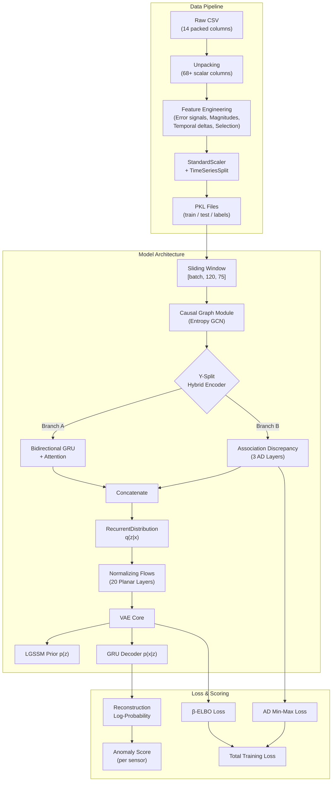

---

# 2. Stage 1 — Data Ingestion & Unpacking

**File**: [utils.py](file:///x:/Omnia_CoreX/AI/OMNI/Version_2_Hybrid/omni_anomaly/utils.py) → [unpack_robot_data](file:///x:/Omnia_CoreX/AI/OMNI/Version_2_Hybrid/omni_anomaly/utils.py#L152-L183)

## Job

The raw robotic arm data arrives from an RTDE (Real-Time Data Exchange) interface as a CSV file where each row is a timestep and most columns contain **string-encoded vectors** (Python lists serialized as text). For example, the column `actual_q` contains `"[0.123, -0.456, 0.789, 1.01, -0.23, 0.56]"` — a 6-element vector representing the joint angles of a 6-DOF robot arm.

The unpacking stage converts these 14 packed columns into 68+ individual scalar columns.

## Input

| Field | Description | Shape |
|-------|-------------|-------|
| `all_data.csv` | Raw RTDE recording | `(N_rows, 14 columns)` |

### Vector Columns Unpacked

| Original Column | Elements | Description |
|-----------------|----------|-------------|
| `target_q` | 6 | Target joint positions (radians) |
| `target_qd` | 6 | Target joint velocities (rad/s) |
| `target_qdd` | 6 | Target joint accelerations (rad/s²) |
| `target_current` | 6 | Target motor currents (A) |
| `target_moment` | 6 | Target joint torques (Nm) |
| `actual_q` | 6 | Actual joint positions (radians) |
| `actual_qd` | 6 | Actual joint velocities (rad/s) |
| `actual_current` | 6 | Actual motor currents (A) |
| `joint_temperatures` | 6 | Joint temperature readings (°C) |
| `target_TCP_pose` | 6 | Target TCP position (x,y,z) + orientation (rx,ry,rz) |
| `actual_TCP_pose` | 6 | Actual TCP position + orientation |

Plus scalar columns: `timestamp`, `robot_mode`.

## Output

| Field | Description | Shape |
|-------|-------------|-------|
| `ready_for_ai.csv` | Unpacked DataFrame | `(N_rows, 68+ columns)` |

## Process

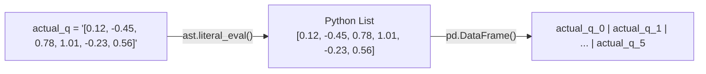

Each vector column is parsed with `ast.literal_eval()`, then expanded into `N` individual columns named `{column}_{index}`.

---

# 3. Stage 2 — Feature Engineering Pipeline

**File**: [feature_engineering.py](file:///x:/Omnia_CoreX/AI/OMNI/Version_2_Hybrid/feature_engineering.py)

This stage transforms the 68+ raw scalar columns into a refined, information-dense feature set optimized for anomaly detection.

## 3.1 Quantile Clipping (Noise Reduction)

**Job**: Clips all sensor values to the [1st, 99th] percentile range to suppress extreme outlier noise in the raw signal before any derived features are computed.

| | Details |
|---|---|
| **Input** | Raw sensor DataFrame `(N, 68+)` |
| **Output** | Clipped sensor DataFrame `(N, 68+)` |
| **Formula** | `x_clipped = clip(x, Q_0.01, Q_0.99)` |

## 3.2 Error Signal Computation

**Function**: [compute_error_signals](file:///x:/Omnia_CoreX/AI/OMNI/Version_2_Hybrid/feature_engineering.py#L4-L32)

**Job**: Computes the deviation between the robot's actual state and its commanded target. This error signal is the **primary anomaly indicator** — when the robot deviates from its target trajectory, something is wrong.

| | Details |
|---|---|
| **Input** | DataFrame containing `actual_*` and `target_*` columns |
| **Output** | DataFrame with `error_*` columns added, `target_*` columns **dropped** |
| **Formula** | `error_q_i = actual_q_i − target_q_i` |
| **Rationale** | Target columns are redundant (recoverable as `target = actual − error`) |

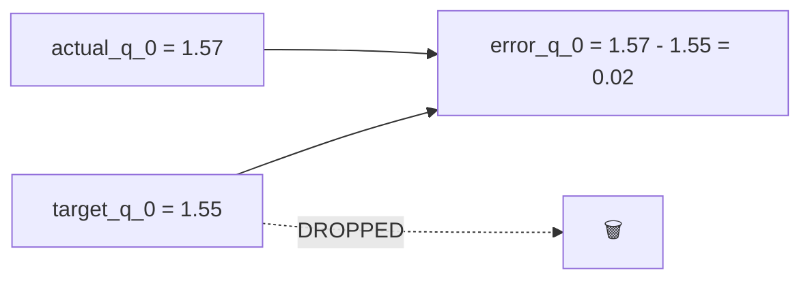

## 3.3 Robotic Magnitudes

**Function**: [add_robotic_magnitudes](file:///x:/Omnia_CoreX/AI/OMNI/Version_2_Hybrid/feature_engineering.py#L116-L152)

**Job**: Computes Euclidean magnitude for 3D vectors (TCP pose position and rotation), providing a scalar summary of the robot's spatial state.

| Feature | Formula | Description |
|---------|---------|-------------|
| `actual_TCP_pose_pos_mag` | √(x² + y² + z²) | Distance from origin in Cartesian space |
| `actual_TCP_pose_rot_mag` | √(rx² + ry² + rz²) | Rotation magnitude (axis-angle representation) |
| `error_TCP_pose_pos_mag` | √(ex² + ey² + ez²) | Position error magnitude |
| `error_TCP_pose_rot_mag` | √(erx² + ery² + erz²) | Rotation error magnitude |

## 3.4 Temporal Delta Features

**Function**: [add_temporal_features](file:///x:/Omnia_CoreX/AI/OMNI/Version_2_Hybrid/feature_engineering.py#L80-L114)

**Job**: Computes first-order differences (velocity/rate-of-change) for meaningful columns. This captures **how fast** a signal is changing — a critical indicator for detecting drift and transient anomalies.

| | Details |
|---|---|
| **Formula** | `x_delta[t] = x[t] − x[t−1]` |
| **Applied to** | `error_*`, `actual_q_*`, `actual_TCP_pose_*` columns |
| **Skipped** | `_qd` (already velocity), `_qdd` (already acceleration), `_current`, `_moment`, `joint_temperatures`, `robot_mode` |
| **NaN Handling** | Back-fill then zero-fill |

## 3.5 Feature Selection

### 3.5.1 Constant Feature Removal

**Function**: [remove_constant_features](file:///x:/Omnia_CoreX/AI/OMNI/Version_2_Hybrid/feature_engineering.py#L35-L51)

Drops columns with zero variance (≤1 unique value). These provide no discriminative information.

### 3.5.2 Correlation-Based Feature Removal

**Function**: [remove_correlated_features](file:///x:/Omnia_CoreX/AI/OMNI/Version_2_Hybrid/feature_engineering.py#L53-L78)

Drops one of each pair of features with Pearson correlation > 0.90. Reduces redundancy without losing information.

## Feature Engineering Summary

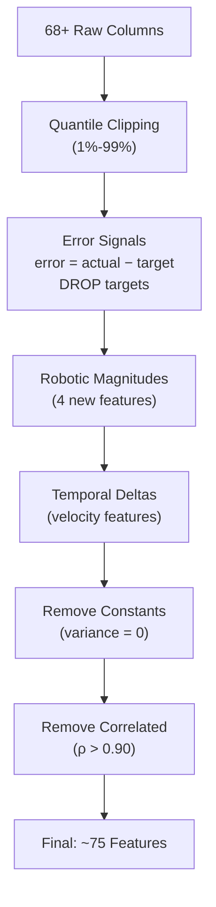

---

# 4. Stage 3 — Data Preprocessing & Windowing

**File**: [data_preprocess.py](file:///x:/Omnia_CoreX/AI/OMNI/Version_2_Hybrid/data_preprocess.py) → [load_data](file:///x:/Omnia_CoreX/AI/OMNI/Version_2_Hybrid/data_preprocess.py#L117-L246)

## 4.1 Time-Series Split

**Job**: Splits the data chronologically (not randomly) using `TimeSeriesSplit(n_splits=3)`. The last fold is used as train/test, preserving temporal ordering.

| | Details |
|---|---|
| **Input** | Feature-engineered array `(N, ~75)` |
| **Output** | `raw_train`, `raw_test` arrays |

## 4.2 Anomaly Injection

See [Stage 12](#13-stage-12--anomaly-factory-synthetic-fault-injection) for full details. Synthetic faults (spike, drift, stuck) are injected into the test set.

## 4.3 Standard Scaling

| | Details |
|---|---|
| **Method** | `StandardScaler` (zero mean, unit variance) |
| **Fit on** | Training data only |
| **Transform** | Both train and test |
| **Formula** | `x_scaled = (x − μ_train) / σ_train` |

## 4.4 Sliding Window (BatchSlidingWindow)

**Class**: [BatchSlidingWindow](file:///x:/Omnia_CoreX/AI/OMNI/Version_2_Hybrid/omni_anomaly/utils.py#L394-L497)

**Job**: Converts the 2D time-series `(T, D)` into overlapping 3D windows `(batch, window_length, D)` for the model. Each window of `window_length=120` consecutive timesteps represents a "context" that the model processes as a unit.

| | Details |
|---|---|
| **Input** | 2D array `(T_total, 75)` |
| **Output** | Iterator yielding batches of shape `(batch_size, 120, 75)` |
| **Window Size** | 120 timesteps |
| **Stride** | 1 (fully overlapping) |
| **Batch Size** | 64 |

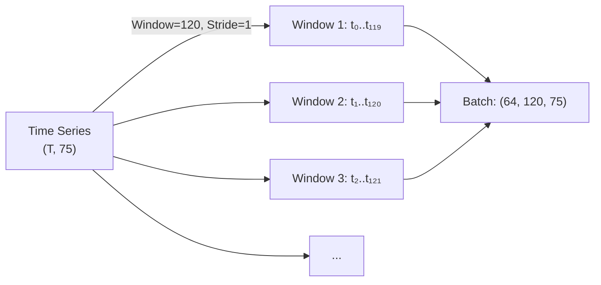

---

# 5. Stage 4 — Causal Graph Module (Entropy GCN)

**Class**: [CausalGraphModule](file:///x:/Omnia_CoreX/AI/OMNI/Version_2_Hybrid/omni_anomaly/model.py#L27-L96)

## Job

The Causal Graph Module implements a **2-layer Graph Convolutional Network (GCN)** that operates on a pre-computed **Transfer Entropy adjacency matrix**. Before the sensor data enters any temporal modeling (GRU, attention), this module propagates causal information across sensors, allowing causally-related sensors to share information.

> **Key Insight**: Transfer Entropy measures the directional information flow between sensors. If joint 3's temperature causally influences joint 5's current draw, this relationship is encoded in the adjacency matrix and exploited by the GCN.

## Transfer Entropy Adjacency Matrix

The adjacency matrix `A` of shape `[N_sensors, N_sensors]` is pre-computed offline and stored as `causal_adj_matrix.npy`. Each entry `A[i,j]` represents the Transfer Entropy from sensor `i` to sensor `j`.

### Normalization (Symmetric Laplacian)

Following the standard GCN convention (Kipf & Welling, 2017):

$$\hat{A} = D^{-1/2} \cdot A \cdot D^{-1/2}$$

Where:
- `D` is the degree matrix: `D[i,i] = Σⱼ A[i,j]`
- `D⁻¹/²[i,i] = (D[i,i] + ε)^{-0.5}`

This normalization ensures that the GCN aggregation step produces weighted averages (not sums), preventing numerical explosion in densely connected graphs.

## Architecture

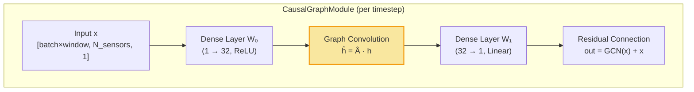

## Layer-by-Layer Detail

### Layer 0: Linear Projection + ReLU

```
h₀ = ReLU(x · W₀ + b₀)
```

| Param | Shape | Description |
|-------|-------|-------------|
| `W₀` | `[1, 32]` | Projection weights |
| `b₀` | `[32]` | Bias |
| Input | `[batch×window, N_sensors, 1]` | Each sensor has 1 feature |
| Output | `[batch×window, N_sensors, 32]` | 32-dim hidden representation per sensor |

### Graph Convolution

```
h₁ = Â · h₀     (via tf.einsum('ij,bjk->bik', Â, h₀))
```

| Param | Shape | Description |
|-------|-------|-------------|
| `Â` | `[N_sensors, N_sensors]` | Normalized adjacency (constant) |
| Input | `[batch×window, N_sensors, 32]` | Hidden features |
| Output | `[batch×window, N_sensors, 32]` | Causally-aggregated features |

Each sensor's 32-dim feature vector is replaced by a weighted sum of its neighbors' features, where the weights come from the Transfer Entropy adjacency matrix.

### Layer 1: Linear Projection (no activation)

```
h₂ = h₁ · W₁ + b₁
```

| Param | Shape |
|-------|-------|
| `W₁` | `[32, 1]` |
| `b₁` | `[1]` |
| Output | `[batch×window, N_sensors, 1]` |

### Residual Connection

```
output = h₂ + x
```

The residual shortcut ensures that the original sensor value is preserved even if the GCN learns a zero transformation, preventing degradation.

## Shape Walkthrough in Context

**Method**: [_causal_process_x](file:///x:/Omnia_CoreX/AI/OMNI/Version_2_Hybrid/omni_anomaly/model.py#L285-L342)

```
Step 1: x_input          → [batch, 120, 75]
Step 2: Reshape           → [batch × 120, 75, 1]
Step 3: CausalGraphModule → [batch × 120, 75, 1]
Step 4: Squeeze           → [batch × 120, 75]
Step 5: Reshape back      → [batch, 120, 75]
```

> **Note**: The GCN processes each timestep independently. It treats the 75 sensors as nodes on a graph and propagates causal information spatially. The temporal dimension is handled entirely by the GRU and AD layers that come after.

---

# 6. Stage 5 — Hybrid Encoder (Y-Split Architecture)

**Method**: [_hybrid_encoder](file:///x:/Omnia_CoreX/AI/OMNI/Version_2_Hybrid/omni_anomaly/model.py#L347-L383)

## Job

The hybrid encoder is the **novel contribution** of Version 2. It takes the causally-enriched sensor data and processes it through two parallel branches that capture different aspects of the signal:

| Branch | Captures | Output Dim |
|--------|----------|------------|
| **Branch A** (GRU) | **Temporal sequence patterns** — how the signal evolves over time | `rnn_num_hidden = 256` |
| **Branch B** (AD) | **Association patterns** — which timesteps attend to which, and whether the attention pattern deviates from a learnable prior | `dense_dim = 256` |

The outputs are concatenated to form a combined representation of shape `[batch, 120, 512]`.

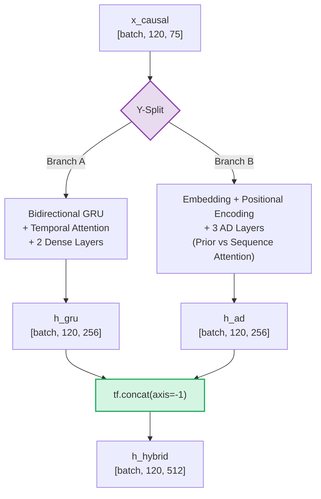

---

## 5.1 Branch A — Bidirectional GRU with Attention

**Function**: [rnn](file:///x:/Omnia_CoreX/AI/OMNI/Version_2_Hybrid/omni_anomaly/wrapper.py#L121-L174)

### Job

Captures **temporal sequential patterns** using a bidirectional GRU (Gated Recurrent Unit) that reads the time series both forward and backward. An attention mechanism then weights the output so the model focuses on the most informative timesteps.

### Architecture

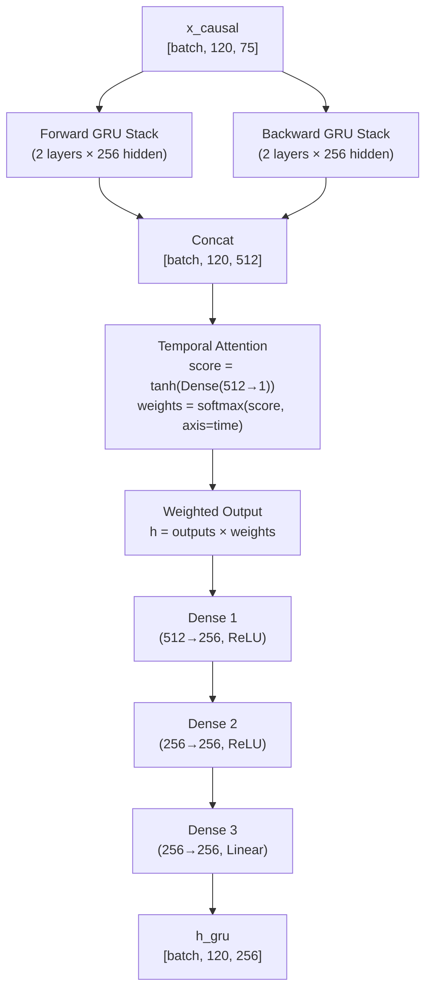

### Layer-by-Layer Detail

| Step | Operation | Input Shape | Output Shape |
|------|-----------|-------------|--------------|
| 1 | Forward GRU (2-layer stack, 256 units) | `[batch, 120, 75]` | `[batch, 120, 256]` |
| 2 | Backward GRU (2-layer stack, 256 units) | `[batch, 120, 75]` | `[batch, 120, 256]` |
| 3 | Concatenate forward + backward | 2 × `[batch, 120, 256]` | `[batch, 120, 512]` |
| 4 | Attention score: `Dense(512→1)` + `tanh` | `[batch, 120, 512]` | `[batch, 120, 1]` |
| 5 | Attention weights: `softmax(score, axis=1)` | `[batch, 120, 1]` | `[batch, 120, 1]` |
| 6 | Weighted multiply: `outputs × weights` | `[batch, 120, 512]` | `[batch, 120, 512]` |
| 7 | Dense (512→256, ReLU) | `[batch, 120, 512]` | `[batch, 120, 256]` |
| 8 | Dense (256→256, ReLU) | `[batch, 120, 256]` | `[batch, 120, 256]` |
| 9 | Dense (256→256, Linear) | `[batch, 120, 256]` | `[batch, 120, 256]` |

### GRU Cell Equations

For each timestep `t`:

```
z_t = σ(W_z · [h_{t-1}, x_t])          (Update gate)
r_t = σ(W_r · [h_{t-1}, x_t])          (Reset gate)
h̃_t = tanh(W · [r_t ⊙ h_{t-1}, x_t])  (Candidate hidden state)
h_t = (1 − z_t) ⊙ h_{t-1} + z_t ⊙ h̃_t (New hidden state)
```

Where `σ` is sigmoid, `⊙` is element-wise multiplication.

### Temporal Attention Mechanism

The attention mechanism learns which timesteps within the 120-step window are most relevant for the current anomaly assessment:

```
score_t = tanh(W_a · h_t + b_a)        (Importance score per timestep)
α_t = softmax(score_t, axis=time)       (Normalized attention weights)
h_attended = h_t × α_t                  (Weighted output)
```

> **Key Insight**: During normal operation, the attention weights distribute relatively uniformly. During anomalies, the weights spike at the anomalous timesteps, amplifying the GRU's sensitivity.

---

## 5.2 Branch B — Association Discrepancy Layers

**Function**: [association_layer](file:///x:/Omnia_CoreX/AI/OMNI/Version_2_Hybrid/omni_anomaly/model.py#L107-L165) and [_association_process_x](file:///x:/Omnia_CoreX/AI/OMNI/Version_2_Hybrid/omni_anomaly/model.py#L388-L428)

### Job

Implements the **Association Discrepancy** mechanism from Wang & Zhang (2025). This branch computes two types of temporal attention — a **Prior Association (P)** based on learned Gaussian temporal distance, and a **Sequence Association (S)** from standard self-attention — then measures their **discrepancy** using symmetric KL divergence.

> **Core Principle**: In normal data, the self-attention pattern S naturally aligns with the Gaussian prior P (because normal patterns are temporally smooth). During anomalies, S deviates sharply from P, producing a high discrepancy score. This discrepancy serves both as an additional anomaly signal and as an adversarial training signal.

### Architecture

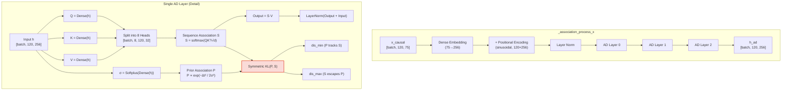

### Positional Encoding

Standard sinusoidal encoding (Vaswani et al., 2017):

```
PE(pos, 2i)   = sin(pos / 10000^{2i/d_model})
PE(pos, 2i+1) = cos(pos / 10000^{2i/d_model})
```

Where `pos` = position in window (0..119), `i` = dimension index, `d_model = 256`.

### Sequence Association (S) — Self-Attention

```
Q = x · W_Q,  K = x · W_K,  V = x · W_V
S = softmax(Q · Kᵀ / √d_k)
```

| Param | Shape | Description |
|-------|-------|-------------|
| `W_Q, W_K, W_V` | `[256, 256]` | Projection matrices |
| `Q, K, V` (after head split) | `[batch, 8, 120, 32]` | Per-head query/key/value |
| `S` | `[batch, 8, 120, 120]` | Self-attention matrix per head |

### Prior Association (P) — Learnable Gaussian Distance

```
Δt = |t_i − t_j|                        (temporal distance between positions)
P[i,j] = exp(−Δt² / 2σ²) / (√(2π) · σ)  (Gaussian kernel)
P = P / sum(P, axis=-1)                  (row-normalized)
```

Where `σ` is a **learnable parameter** per head (produced by `Softplus(Dense(x))`) with shape `[batch, 8, 1]`.

| Param | Shape | Description |
|-------|-------|-------------|
| `σ` | `[batch, n_heads]` | Learned Gaussian width per head |
| `Δt²` | `[120, 120]` | Pairwise squared time distances |
| `P` | `[batch, 8, 120, 120]` | Prior attention matrix |

### Symmetric KL Divergence (Association Discrepancy)

```
KL(P ‖ Q) = Σ P · log(P / Q)
SymKL(P, S) = KL(P ‖ S) + KL(S ‖ P)
```

### Min-Max Adversarial Strategy

The discrepancy is split into two separate optimization targets using `tf.stop_gradient`:

| Loss Term | Formula | Goal |
|-----------|---------|------|
| `dis_min` | `SymKL(P, stop_gradient(S))` | **Prior minimizes** — P learns to track S (make P resemble normal attention patterns) |
| `dis_max` | `SymKL(stop_gradient(P), S)` | **Sequence maximizes** — S learns to deviate from P (make anomalies more distinguishable) |

This adversarial push-pull creates a tight "normal band" that anomalies break out of.

### AD Layer Stack

| | Details |
|---|---|
| **Number of layers** | 3 (`config.adm_layers = 3`) |
| **Heads per layer** | 8 (`config.n_heads = 8`) |
| **d_model** | 256 (`config.dense_dim = 256`) |
| **d_k** (per head) | 32 (`256 / 8`) |

---

# 7. Stage 6 — Recurrent Distribution (Temporal Posterior)

**Class**: [RecurrentDistribution](file:///x:/Omnia_CoreX/AI/OMNI/Version_2_Hybrid/omni_anomaly/recurrent_distribution.py)

## Job

The RecurrentDistribution is the **temporal glue** between the encoder and the latent space. It implements a recurrent process where each timestep's latent variable `z_t` depends on both the current encoder output and the previous latent variable `z_{t-1}`. This creates an **autoregressive posterior** that captures temporal dependencies in the latent space.

> **Core Principle**: Unlike a standard VAE where each timestep's z is sampled independently, the RecurrentDistribution chains them: `z_t = f(encoder_output_t, z_{t-1}) + noise`. This makes the posterior distribution aware of the temporal context.

## Architecture

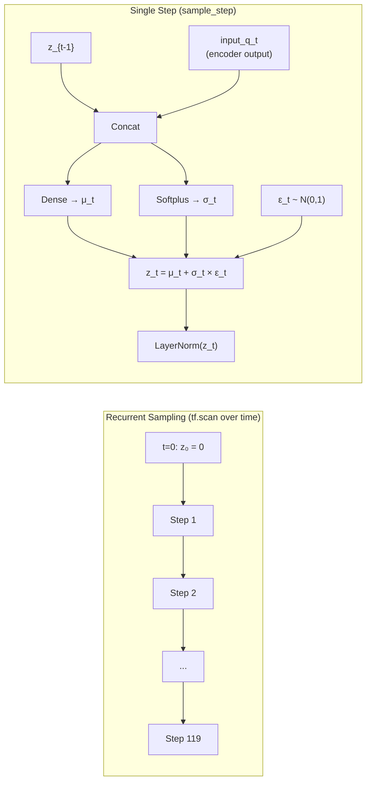

## Constructor

**Method**: [__init__](file:///x:/Omnia_CoreX/AI/OMNI/Version_2_Hybrid/omni_anomaly/recurrent_distribution.py#L127-L173)

| Parameter | Value | Description |
|-----------|-------|-------------|
| `input_q` | Tensor `[batch, window, encoder_dim]` | Output from hybrid encoder (512-dim) |
| `z_dim` | 64 | Latent dimension |
| `window_length` | 120 | Number of timesteps |
| `mean_q_mlp` | `Dense(z_dim)` | MLP for posterior mean |
| `std_q_mlp` | `softplus_std(z_dim)` | MLP for posterior std (with safety floor) |

The constructor transposes `input_q` to time-first format `[120, batch, 512]` for efficient `tf.scan`.

## sample_step

**Method**: [sample_step](file:///x:/Omnia_CoreX/AI/OMNI/Version_2_Hybrid/omni_anomaly/recurrent_distribution.py#L38-L72)

| Step | Operation | Shape |
|------|-----------|-------|
| 1 | Expand `input_q_t` for n_samples | `[n_z, batch, 512]` |
| 2 | Concat `[input_q_t, z_{t-1}]` | `[n_z, batch, 512 + 64]` |
| 3 | MLP → `μ_t` | `[n_z, batch, 64]` |
| 4 | Softplus → `σ_t` (with ε floor) | `[n_z, batch, 64]` |
| 5 | Reparameterization: `z_t = μ_t + σ_t × noise_t` | `[n_z, batch, 64]` |
| 6 | Layer Norm on `z_t` | `[n_z, batch, 64]` |

### The Reparameterization Trick

Instead of sampling `z` directly from `N(μ, σ²)` (which would break gradient flow), we sample noise from a standard normal and transform it:

```
ε ~ N(0, I)
z = μ + σ ⊙ ε
```

This allows gradients to flow through `μ` and `σ` while still sampling stochastically.

## sample (Full Sequence)

**Method**: [sample](file:///x:/Omnia_CoreX/AI/OMNI/Version_2_Hybrid/omni_anomaly/recurrent_distribution.py#L176-L223)

| Step | Operation | Shape |
|------|-----------|-------|
| 1 | Generate noise | `[120, n_z, batch, 64]` |
| 2 | Initialize `z_0 = 0` | `[n_z, batch, 64]` |
| 3 | `tf.scan(sample_step, ...)` | `[120, n_z, batch, 64]` |
| 4 | Transpose to standard format | `[n_z, batch, 120, 64]` |
| 5 | Wrap in `StochasticTensor` | — |

Default `n_samples = 5` for Importance Weighted sampling.

## log_prob

**Method**: [log_prob](file:///x:/Omnia_CoreX/AI/OMNI/Version_2_Hybrid/omni_anomaly/recurrent_distribution.py#L226-L265)

Evaluates the log-probability of a given z sequence under the recurrent posterior:

```
log p(z_t | z_{<t}, x) = -log(σ_t) - 0.5·log(2π) - 0.5·((z_t − μ_t)/σ_t)²
```

With numerical safety:
- `σ_t` clamped to minimum `1e-6`
- `((z − μ)/σ)²` capped at `100` to prevent Inf
- `log_prob` clipped to `[-50, 0]`

---

# 8. Stage 7 — VAE Core (Variational Auto-Encoder)

**Class**: [VAE](file:///x:/Omnia_CoreX/AI/OMNI/Version_2_Hybrid/omni_anomaly/vae.py#L12-L396)

## Job

The VAE is the central probabilistic framework that coordinates three distributions — the prior `p(z)`, the posterior `q(z|x)`, and the likelihood `p(x|z)` — through a variational inference objective (ELBO). It answers the question: **"Given this sensor reading, what is the most likely latent state of the robot, and how well can we reconstruct the reading from that state?"**

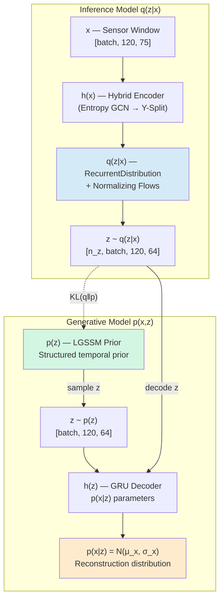

---

## 7.1 Prior p(z) — Linear Gaussian State Space Model

**Wrapper**: [TfpDistribution](file:///x:/Omnia_CoreX/AI/OMNI/Version_2_Hybrid/omni_anomaly/wrapper.py#L9-L97)

### Job

The prior distribution over the latent variable `z` is **not** a simple isotropic Gaussian. Instead, it uses a **Linear Gaussian State Space Model (LGSSM)** from TensorFlow Probability. This structured prior assumes that the latent states evolve linearly over time with Gaussian noise, which is a much better inductive bias for time-series data than assuming i.i.d. Gaussian latents.

### Mathematical Definition

```
z₀ ~ N(0, I)                            (Initial state prior)
z_t = F · z_{t-1} + w_t,  w_t ~ N(0, Q)  (State transition)
x_t = H · z_t + v_t,      v_t ~ N(0, R)  (Observation model)
```

Where in our configuration:
- `F = I` (Identity transition matrix — random walk prior)
- `Q = I` (Unit transition noise)
- `H = I` (Identity observation matrix)
- `R = I` (Unit observation noise)
- `z_dim = 64`
- `num_timesteps = 120`

### TfpDistribution Wrapper

The `TfpDistribution` class bridges TensorFlow Probability's `LinearGaussianStateSpaceModel` with tfsnippet's `Distribution` interface. Key adaptations:

| Method | Adaptation |
|--------|------------|
| `sample()` | Calls `_distribution.sample(n_samples)`, wraps in `StochasticTensor`. Default 5 samples for IWAE. |
| `log_prob()` | Uses `forward_filter()` (Kalman filter) for efficient log-likelihood computation. Sums over the time dimension. |

### Shape Summary

| Tensor | Shape |
|--------|-------|
| `p(z).sample(5)` | `[5, 120, 64]` |
| `p(z).log_prob(z)` | `[n_z, batch]` (after summing over time) |

---

## 7.2 Posterior q(z|x) — RecurrentDistribution + Normalizing Flows

### RecurrentDistribution

See [Stage 6](#7-stage-6--recurrent-distribution-temporal-posterior) for full details. The posterior is parameterized by the hybrid encoder output and uses a recurrent structure.

### Normalizing Flows (Posterior Enhancement)

**Config**: `posterior_flow_type = 'nf'`, `nf_layers = 20`

**Job**: Normalizing flows transform a simple distribution (the RecurrentDistribution's Gaussian posterior) into a more expressive, multi-modal distribution through a series of invertible transformations. This is critical because real-world robot dynamics may have complex, non-Gaussian latent distributions.

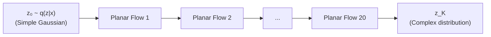

Each planar flow applies:

```
z_k = z_{k-1} + u · tanh(wᵀ · z_{k-1} + b)
```

Where `u`, `w`, `b` are learnable parameters. The log-determinant of the Jacobian is:

```
log|det(∂f/∂z)| = log|1 + uᵀ · (1 − tanh²(wᵀ · z + b)) · w|
```

| Parameter | Value |
|-----------|-------|
| Number of flow layers | 20 |
| Flow type | Planar (Rezende & Mohamed, 2015) |
| Applied via | `FlowDistribution(q_z_dist, posterior_flow)` in [VAE.variational](file:///x:/Omnia_CoreX/AI/OMNI/Version_2_Hybrid/omni_anomaly/vae.py#L249-L270) |

---

## 7.3 Decoder p(x|z) — GRU Reconstruction Network

### Job

The decoder takes latent samples `z` and reconstructs the original sensor readings. It consists of a GRU-based hidden network followed by separate mean and standard deviation heads.

### Architecture

**Lambda wrapper**: [h_for_p_x](file:///x:/Omnia_CoreX/AI/OMNI/Version_2_Hybrid/omni_anomaly/model.py#L242-L257)
**Network**: [wrap_params_net](file:///x:/Omnia_CoreX/AI/OMNI/Version_2_Hybrid/omni_anomaly/wrapper.py#L178-L202)

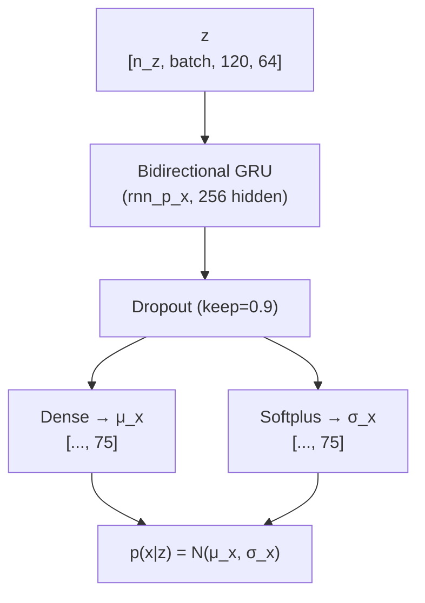

| Step | Operation | Output Shape |
|------|-----------|--------------|
| 1 | Bidirectional GRU (same architecture as encoder) | `[batch, 120, 256]` |
| 2 | Dropout (10% rate, active during both train and test) | `[batch, 120, 256]` |
| 3 | Dense → `μ_x` | `[batch, 120, 75]` |
| 4 | `softplus_std` → `σ_x` (floor = 1e-4) | `[batch, 120, 75]` |

### softplus_std Safety Mechanism

**Function**: [softplus_std](file:///x:/Omnia_CoreX/AI/OMNI/Version_2_Hybrid/omni_anomaly/wrapper.py#L100-L119)

```python
raw_std = Dense(inputs, units)           # Unconstrained output
std = softplus(raw_std)                   # Ensure positive (softplus = log(1+e^x))
std = max(std, epsilon) + 1e-8            # Hard floor to prevent collapse
```

This prevents the decoder from collapsing to zero variance (which would cause infinite log-probability and NaN gradients).

---

## 7.4 Variational Chain & ELBO

**Method**: [VAE.chain](file:///x:/Omnia_CoreX/AI/OMNI/Version_2_Hybrid/omni_anomaly/vae.py#L295-L333)

### Job

The `chain` method connects the inference and generative networks to produce a `VariationalChain` object, which provides access to the ELBO and its components.

### Process

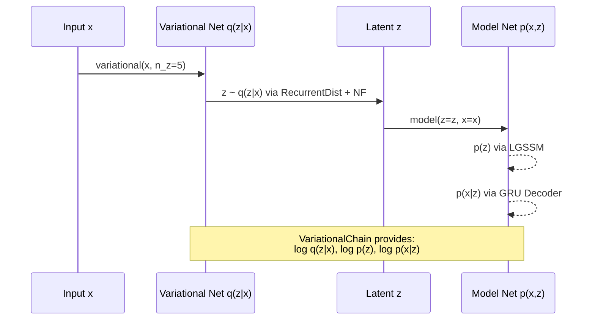

---

# 9. Stage 8 — Training Loss (Composite Objective)

**Method**: [OmniAnomaly.get_training_loss](file:///x:/Omnia_CoreX/AI/OMNI/Version_2_Hybrid/omni_anomaly/model.py#L459-L563)

## Job

Computes the total training loss as a weighted combination of three components:

1. **β-ELBO** — The variational lower bound with β-weighting on the KL term
2. **L2 Regularization** — Weight decay on all non-bias parameters
3. **Association Discrepancy Loss** — The Min-Max adversarial loss from Branch B

### Mathematical Formulation

```
L_total = L_β-ELBO + λ_L2 · L_L2 + k · L_AD
```

Where:

```
L_β-ELBO = -E_q[log p(x|z)] + β · KL(q(z|x) ‖ p(z))
L_L2     = Σ ‖w‖² for all non-bias weights
L_AD     = mean(dis_min − dis_max)  (Min-Max adversarial)
```

## Component Breakdown

### β-ELBO

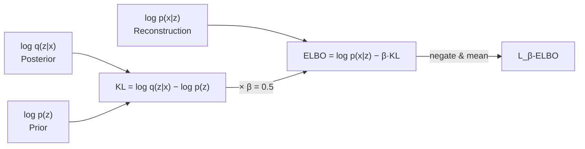

| Term | Description | Shape Flow |
|------|-------------|------------|
| `log p(x\|z)` | How well z reconstructs x (per sensor) | `[n_z, batch, 120, 75]` → `[n_z, batch]` |
| `log q(z\|x)` | Posterior probability of z | `[n_z, batch, 120, 64]` → `[n_z, batch]` |
| `log p(z)` | Prior probability of z (LGSSM) | `[n_z, batch, 120]` → `[n_z, batch]` |
| `β` | KL weight (0.5 = favor reconstruction) | scalar |

The `_to_nz_batch` helper function handles the complex shape alignment between these terms, which can have different dimensionalities depending on whether sampling is used.

### L2 Regularization

```
L_L2 = Σ_v ‖v‖²  for v in trainable_variables if 'bias' not in v.name
```

| Parameter | Value |
|-----------|-------|
| `l2_reg` | 0.0001 |

### Association Discrepancy Loss

The reconstruction `x_rec = p(x|z).sample()` is also passed through the AD layers (with weight sharing via `reuse=True`). This creates a second set of discrepancy scores on the reconstructed data:

```
L_AD = k · mean(dis_min − dis_max)
```

| Parameter | Value | Description |
|-----------|-------|-------------|
| `k_weight` | 3.0 | Weight for AD loss contribution |
| `dis_min` | Averaged over 3 AD layers | Prior tracking loss |
| `dis_max` | Averaged over 3 AD layers | Sequence distinction loss |

> **Intuition**: `dis_min − dis_max` is negative when the model successfully makes P track S (minimizing their gap). The negative sign plus the mean makes this a loss to be minimized, pushing P closer to S while S tries to be as distinguishable as possible.

---

# 10. Stage 9 — Training Loop

**Class**: [Trainer](file:///x:/Omnia_CoreX/AI/OMNI/Version_2_Hybrid/omni_anomaly/training.py)

## Job

Orchestrates the complete training process: data windowing, gradient computation, learning rate scheduling, validation, and early stopping.

## Architecture

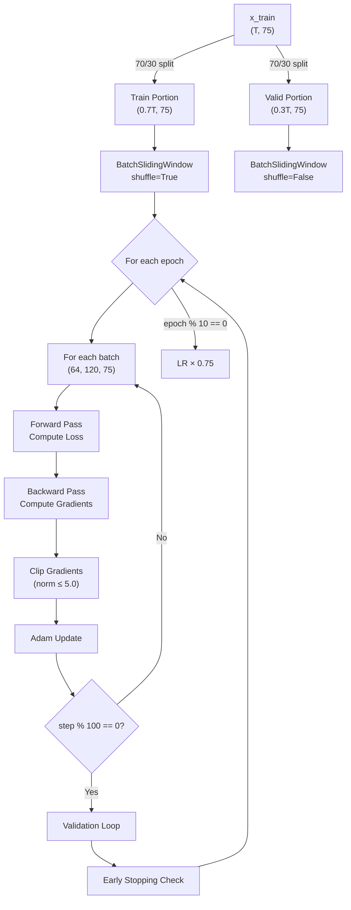

## Training Configuration

| Parameter | Value | Description |
|-----------|-------|-------------|
| `optimizer` | Adam | Adaptive learning rate optimizer |
| `initial_lr` | 0.001 | Starting learning rate |
| `lr_anneal_epochs` | 10 | Decay LR every 10 epochs |
| `lr_anneal_factor` | 0.75 | Multiply LR by 0.75 each decay |
| `gradient_clip_norm` | 5.0 | Max gradient norm (prevents exploding gradients) |
| `valid_step_freq` | 100 | Validate every 100 training steps |
| `early_stopping` | True | Stop if validation loss stops improving |
| `batch_size` | 64 | Mini-batch size |
| `max_epoch` | 100-150 (1 for testing) | Maximum training epochs |

## Gradient Clipping Detail

```python
for grad, var in gradients:
    grad = tf.clip_by_norm(grad, 5.0)     # Preserve direction, limit magnitude
    grad = tf.check_numerics(grad, ...)    # Crash early on NaN/Inf
```

Gradient clipping by norm (not by value) is critical for RNN stability — it preserves the direction of the gradient while limiting its magnitude, preventing the exploding gradient problem common in long sequences.

---

# 11. Stage 10 — Anomaly Scoring & Root Cause Analysis

**Method**: [OmniAnomaly.get_score](file:///x:/Omnia_CoreX/AI/OMNI/Version_2_Hybrid/omni_anomaly/model.py#L567-L614)
**Class**: [Predictor](file:///x:/Omnia_CoreX/AI/OMNI/Version_2_Hybrid/omni_anomaly/prediction.py)

## Job

Converts the trained model into an anomaly detector by computing the **reconstruction log-probability** for each sensor at each timestep. Low log-probability = high reconstruction error = anomaly.

## Score Computation Pipeline

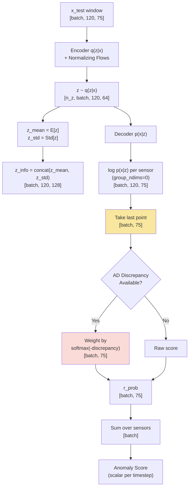

## Key Design Decisions

### Per-Sensor Scoring (group_ndims=0)

```python
r_prob = p_net['x'].log_prob(group_ndims=0)  # Shape: [batch, 120, 75]
```

Setting `group_ndims=0` means we get the log-probability **per individual sensor**, not the joint log-probability. This enables **Root Cause Analysis** — identifying which specific sensor(s) are anomalous.

### Last-Point-Only Mode

```python
r_prob = r_prob[:, -1, :]  # Take only the last timestep
```

For real-time detection, we only score the most recent timestep in each window. The full 120-step context is used to build the encoding, but only the final point is scored.

### AD-Weighted Scoring (Wang & Zhang Eq. 16)

```python
dis_weight = softmax(-discrepancy, axis=-1)    # High discrepancy → high weight
r_prob = r_prob * expand_dims(dis_weight, -1)  # Weight per-sensor scores
```

The Association Discrepancy score acts as an **attention weight** on the reconstruction probability. Sensors at timesteps where the temporal attention pattern deviates from the learned prior receive higher weight, amplifying their contribution to the final anomaly score.

### Predictor Batch Processing

The [Predictor](file:///x:/Omnia_CoreX/AI/OMNI/Version_2_Hybrid/omni_anomaly/prediction.py#L15-L143) class handles efficient batch inference:

1. Builds inference graph lazily on first call
2. Slides a window across the entire test set
3. Sums per-sensor log-probs to get a single score per timestep (joint log-likelihood)
4. Returns scores, latent encodings, and timing statistics

---

# 12. Stage 11 — Evaluation Methods

**File**: [eval_methods.py](file:///x:/Omnia_CoreX/AI/OMNI/Version_2_Hybrid/omni_anomaly/eval_methods.py)

## 12.1 Brute-Force Threshold Search

**Function**: [bf_search](file:///x:/Omnia_CoreX/AI/OMNI/Version_2_Hybrid/omni_anomaly/eval_methods.py#L98-L146)

**Job**: Sweeps 500 threshold values across the score range to find the one that maximizes the adjusted F1-Score.

```
For threshold τ in linspace(score_min − 5%, score_max + 5%, 500):
    predict = (score < τ)     ← anomaly = score BELOW threshold (log-prob convention)
    f1 = adjusted_f1(predict, labels)
    if f1 > best_f1: update best
```

## 12.2 Segment-Level Adjustment

**Function**: [adjust_predicts](file:///x:/Omnia_CoreX/AI/OMNI/Version_2_Hybrid/omni_anomaly/eval_methods.py#L27-L74)

**Job**: If the model detects **any point** within a contiguous anomaly segment, the entire segment is credited as detected. This is the standard evaluation protocol for time-series anomaly detection, since early detection of a gradual fault should count as a success even if not every individual point is flagged.

## 12.3 Peaks-Over-Threshold (POT)

**Function**: [pot_eval](file:///x:/Omnia_CoreX/AI/OMNI/Version_2_Hybrid/omni_anomaly/eval_methods.py#L149-L187)

**Job**: Automatic threshold selection using Extreme Value Theory. The training scores are used to fit a SPOT model, which then determines a statistically-grounded threshold for the test scores.

| Step | Description |
|------|-------------|
| 1 | Negate all scores (SPOT expects upper-tail extremes) |
| 2 | Fit SPOT on negated training scores |
| 3 | Run SPOT on negated test scores to find threshold |
| 4 | Negate threshold back to original scale |

## Metrics Computed

| Metric | Formula |
|--------|---------|
| **F1-Score** | `2 · P · R / (P + R)` |
| **Precision** | `TP / (TP + FP)` |
| **Recall** | `TP / (TP + FN)` |
| **Accuracy** | `(TP + TN) / N` |
| **Latency** | Average detection delay within anomaly segments |

---

# 13. Stage 12 — Anomaly Factory (Synthetic Fault Injection)

**File**: [anomaly_factory.py](file:///x:/Omnia_CoreX/AI/OMNI/Version_2_Hybrid/anomaly_factory.py)

## Job

Since the robotic arm data is collected during normal operation, there are no labeled anomalies. The Anomaly Factory **synthetically injects** realistic faults into the test set, creating ground-truth labels for evaluation.

## Fault Types

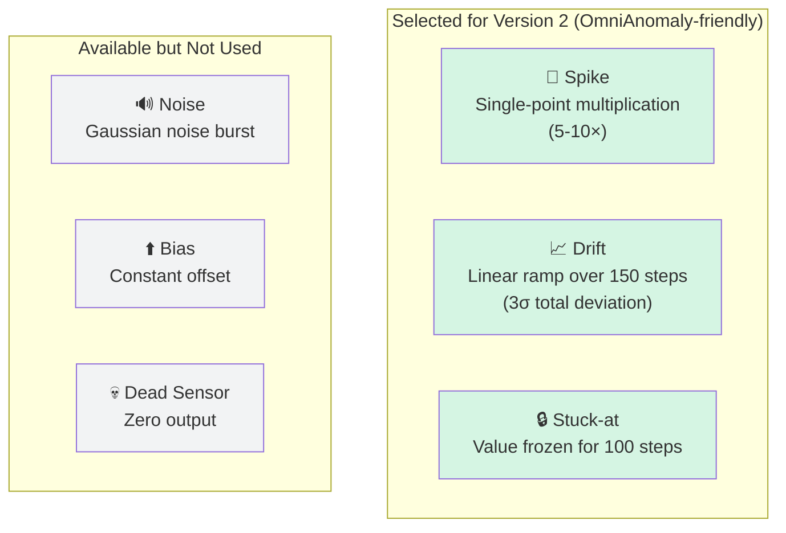

### Spike Injection

**Function**: [inject_spike](file:///x:/Omnia_CoreX/AI/OMNI/Version_2_Hybrid/anomaly_factory.py#L78-L100)

| | Details |
|---|---|
| **Duration** | 1 timestep |
| **Magnitude** | 5× to 10× the original value (random) |
| **Zero handling** | If original ≈ 0, adds the multiplier directly |
| **Label** | Single point = 1 |

### Drift Injection

**Function**: [inject_drift](file:///x:/Omnia_CoreX/AI/OMNI/Version_2_Hybrid/anomaly_factory.py#L103-L129)

| | Details |
|---|---|
| **Duration** | 150 timesteps |
| **Slope** | `3 × std(sensor) / duration` — ramps up to 3 standard deviations |
| **Shape** | Linear increase: `drift[i] = i × slope` |
| **Label** | All 150 points = 1 |

### Stuck-at Injection

**Function**: [inject_stuck_at](file:///x:/Omnia_CoreX/AI/OMNI/Version_2_Hybrid/anomaly_factory.py#L132-L152)

| | Details |
|---|---|
| **Duration** | 100 timesteps |
| **Behavior** | Sensor value frozen at `data[start_idx, sensor]` |
| **Label** | All 100 points = 1 |

### Injection Strategy

**Function**: [create_anomaly_test_set](file:///x:/Omnia_CoreX/AI/OMNI/Version_2_Hybrid/anomaly_factory.py#L260-L318)

- Test set divided into `num_anomalies` equal segments (default 10)
- Each segment gets one random fault at a random position with 15-point buffer from edges
- Forbidden columns (timestamps, cycle counters) are excluded from injection
- Labels are OR-merged across all injections

---

# 14. Complete Data Flow Summary

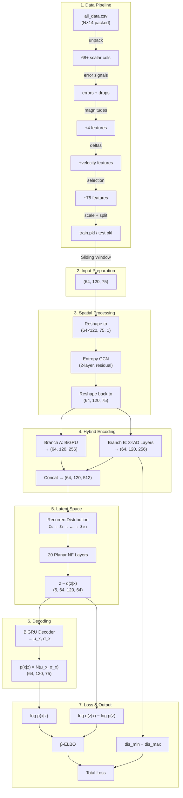

---

# 15. Hyperparameter Reference Table

| Category | Parameter | Value | Description |
|----------|-----------|-------|-------------|
| **Data** | `x_dim` | ~75 (auto-detected) | Number of sensor features after engineering |
| **Data** | `window_length` | 120 | Context window size (timesteps) |
| **Data** | `batch_size` | 64 | Mini-batch size |
| **Encoder** | `rnn_num_hidden` | 256 | GRU hidden units (Branch A) |
| **Encoder** | `rnn_cell` | GRU | Recurrent cell type |
| **Encoder** | `dense_dim` | 256 | Dense/embedding dimension (Branch B & decoder) |
| **AD Layers** | `adm_layers` | 3 | Number of Association Discrepancy layers |
| **AD Layers** | `n_heads` | 8 | Multi-head attention heads |
| **AD Layers** | `k_weight` | 3.0 | AD loss weight |
| **Latent** | `z_dim` | 64 | Latent space dimension |
| **Latent** | `beta` | 0.5 | β-VAE KL weight (< 1 = favor reconstruction) |
| **Prior** | `use_connected_z_p` | True | Use LGSSM prior (vs. standard Normal) |
| **Posterior** | `use_connected_z_q` | True | Use RecurrentDistribution (vs. standard Normal) |
| **Flows** | `posterior_flow_type` | 'nf' | Normalizing flow type |
| **Flows** | `nf_layers` | 20 | Number of planar flow layers |
| **Training** | `initial_lr` | 0.001 | Initial learning rate |
| **Training** | `lr_anneal_epoch_freq` | 10 | LR decay interval (epochs) |
| **Training** | `lr_anneal_factor` | 0.75 | LR decay multiplier |
| **Training** | `gradient_clip_norm` | 5.0 | Max gradient L2 norm |
| **Training** | `l2_reg` | 0.0001 | L2 regularization weight |
| **Training** | `std_epsilon` | 1e-4 | Minimum standard deviation floor |
| **Training** | `early_stop` | True | Enable early stopping |
| **Scoring** | `test_n_z` | 10 | Monte Carlo samples for scoring |
| **Scoring** | `get_score_on_dim` | True | Per-sensor scoring (RCA) |
| **Evaluation** | `level` | 0.01 | POT risk level |

---

# Summary

The Version 2 Hybrid architecture integrates three complementary paradigms into a unified anomaly detection system:

1. **Causal Graph Convolution** (CGAD) provides **spatial context** by propagating information between causally-related sensors using a Transfer Entropy adjacency matrix and a 2-layer GCN with residual connections.

2. **The Y-Split Hybrid Encoder** processes the causally-enriched data through two parallel branches:
   - **Branch A** (Bidirectional GRU + Temporal Attention) captures **sequential temporal patterns** — how the robot's state evolves over time.
   - **Branch B** (Association Discrepancy layers) captures **attention pattern anomalies** — when the temporal self-attention deviates from a learned Gaussian prior, signaling abnormal temporal relationships.

3. **The Probabilistic VAE Core** with:
   - A **Linear Gaussian State Space Model prior** that imposes structured temporal dynamics on the latent space.
   - A **RecurrentDistribution posterior** that creates autoregressive latent variables aware of temporal context.
   - **20 Planar Normalizing Flows** that enhance the posterior's expressiveness to capture complex, non-Gaussian latent distributions.
   - A **β-weighted ELBO** with β=0.5 that prioritizes reconstruction fidelity (critical for per-sensor anomaly scoring).

The training objective combines three losses: the β-ELBO for reconstruction quality, L2 regularization for generalization, and the Min-Max Association Discrepancy loss for adversarial sharpening of the temporal attention boundary between normal and anomalous patterns.

At inference time, the model produces **per-sensor reconstruction log-probabilities** weighted by the Association Discrepancy attention, enabling both **anomaly detection** (low total log-probability) and **Root Cause Analysis** (which individual sensors have the lowest log-probability).
